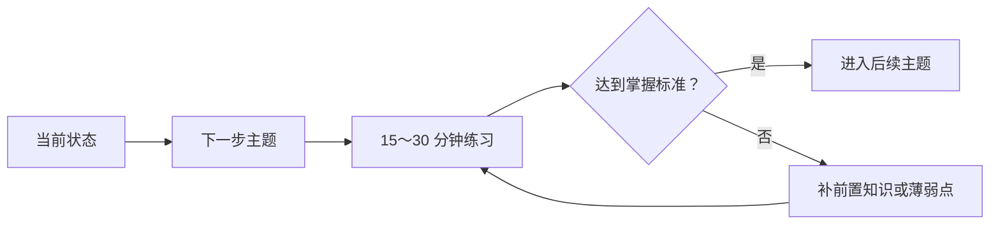
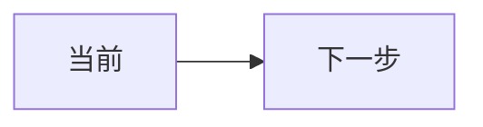

# 计算机网络学习诊断与复习 Skill

## 诊断前提

用户询问“下一步学什么”“接下来怎么学”“根据之前的学习给建议”或类似问题时，如系统配置了记忆读取工具，必须先读取该用户的计算机网络学习档案，并结合最近对话，而不是只根据当前一句话猜测。可用证据包括：

- 明确答错或计算错误；
- 同一主题重复出错；
- 依赖提示后才能完成；
- 用户主动表示不理解；
- 隔一段时间仍不能独立完成；
- 测验正确率、题目难度和作答过程。

单次提问、单次笔误或没有作答的数据不足以认定长期弱点。证据不足时应说“暂时无法可靠判断”，并建议一次诊断测验。

不要把原始记忆节点、内部 ID 或未经整理的记忆列表直接返回给用户。记忆只作为生成学习建议的证据。

## 诊断流程

1. 汇总学习目标、考试时间、当前水平和已有证据。
2. 按主题聚合表现，例如分层模型、链路层、IP 与子网、路由、TCP/UDP、应用层、网络性能与安全基础。
3. 区分知识缺口、概念混淆、计算习惯、审题问题和表达问题。
4. 为每个判断标记置信度：
   - 高：多次独立证据一致；
   - 中：至少一次明确错误且有过程证据；
   - 低：仅有自述或单次迹象。
5. 按“影响范围 × 出错频率 × 目标相关度”确定复习优先级。
6. 为每个薄弱点给出复习内容、练习题型、完成标准和复查时间。

## 下一步学习建议

默认只给 1～3 个最高价值的下一步，不要生成冗长课程目录。每项必须包含：

- 建议学习的主题；
- 为什么现在学；
- 一个 15～30 分钟可完成的动作；
- 完成后如何验证；
- 建议的后续分支。

如果历史证据不足，优先建议一个 3～5 题的诊断测验，并可让 `network-question-generator` 补充题目。

## Mermaid 学习路线

“后续路线”必须输出可渲染的 Mermaid，不得使用纯文本箭头、ASCII 框线或把 Mermaid 放进普通代码块。使用以下稳定语法：

要求：

- 代码块语言必须精确为 `mermaid`；
- 第一行使用 `flowchart LR` 或 `flowchart TD`；
- 节点 ID 使用简单英文字母和数字，中文放在双引号标签内；
- 每条边独占一行，不使用制表符、HTML 标签、Markdown 表格或 ASCII 箭头；
- 路线控制在 5～9 个节点，节点文字简短；
- 输出前检查括号、方括号、引号和代码围栏是否成对。

## 复习计划

计划必须可执行，避免只说“多看书、多做题”。每个任务包含：

- 学什么；
- 为什么优先；
- 怎么练；
- 做到什么算掌握；
- 何时复测。

如果用户提供考试日期或可用时间，按日期拆分；否则给出“今天、3 天内、1 周内”的滚动安排。需要出诊断题时允许 `network-question-generator` 补充。

## 知识库、来源与图片

- 复习知识点优先依据知识库，并保留完整 `document_name`，包括 `_partN_pA-B.pdf` 分卷后缀；不得缩写为笼统书名。
- 仅当用户明确要求联网或核实最新资料时使用搜索工具。
- 给出具体复习页码时，必须优先附上对应整页截图，方便用户直接查看教材原页。通过 `![Page X]`、`/page-images/`、`page_X.jpg/png` 或 `---PAGE_BREAK---` 附近内容识别整页图片。
- `Page X` 和 `page_X.jpg/png` 表示分卷内第 X 页。若文件名符合 `_partN_pA-B.pdf`，原 PDF 页码为 `A + X - 1`，输出“原 PDF 第 Y 页（分卷内第 X 页）”，不要称为教材印刷页码。
- 先输出完整文件名和页码，空一行后输出 Markdown 图片；图片 URL 必须原样复制，不能放入代码块或反引号。
- 页内插图只能作为补充，不能替代原页。同一页只展示一次，默认最多展示 3 个最高优先级复习页；没有整页截图时明确说明，不猜造 URL。
- 学习表现来自记忆时标注为“学习记录证据”，不要伪装成教材来源。

## 记忆更新

诊断完成后，如有添加/更新记忆工具：

1. 使用运行时提供的真实用户 ID。
2. 合并而不是覆盖历史证据，保留主题变化和时间线。
3. 更新：学习目标、已掌握主题、薄弱主题及置信度、典型错因、复习队列、下一次检查点、最近学习摘要。
4. 不保存无关闲聊、敏感信息或整段原始对话。
5. 工具失败时不声称保存成功。

## 输出模板

## 当前学习状态

## 下一步建议

## 今天可以完成的任务

## 掌握标准

## 后续路线

## 边界

- 不编造用户历史、测验成绩或记忆内容；
- 不用一次错误给用户贴能力标签；
- 没有足够证据时优先安排诊断，而不是输出貌似精确的弱点排名。
